# Bookstore

## Függőségek kiválasztása

A Bookstore létrehozásához szükséges a Spring Boot használata, a web függőségei, a H2 helyi adatbázis, ennek eléréséhez a JPA.
Kiválasztottam még a Lombokot, amelyet Getterek, Setterek ToStringek és konstruktorok (AllArgsConstructor és NoArgsConstructor) generálására használtam. A projektet a Maven segítségével állítottam össze.
A függőségek a pom.xml fájlban láthatók.

## H2 adatbázis konfigurálása

A H2 adatbázis működéséhez szükséges néhány információt megjeleníteni az application.properties fájlban.

A képen látható információk szükségesek. Az 1. sor az appunk neve, a 2. sor létrehoz egy in memory adatbázist, testdb néven.
A 3. sor az adatbázis kezeléséhez használt drivert jelenti. Ezt követően beállíthatunk egy felhasználónevet és egy jelszót.
Erre szükségünk lesz, amikor a H2 console segítségével akarjuk elérni az adatbázist. Az utolsó előtti sor ezt kapcsolja be.
A JPA-val kapcsolatos részek közül az első a hibernate segítségével valósítja meg a Java adatbázis elérő rétegét, az utolsó sor pedig engedi az sql utasítások használatát, a JPA által generált lekérdezések naplózását.
A szükséges információk megtalálhatók a [baeldung.com a H2 adatbázishoz](https://www.baeldung.com/spring-boot-h2-database) oldalon, illetve a [h2database.com](https://www.h2database.com/html/features.html#feature_list) oldalon.

## Az entitások létrehozása

A következő lépés az entitások létrehozása. A bookstore package-en belül a model részeként létrehozzuk egy Java osztályként, és ellátjuk a @Entity annotációval.
Ezt követően ellátjuk a @Data Lombok annotációval (ehhez szükség van a korábban tárgyalt Lombok dependency hozzáadásához).
Ettől az osztály adatosztállyá válik, ami azt jelenti, hogy tartalmazza a gettereket, settereket stb.
Ha ez megvan, létrehozunk egy private Long id adattagot, és ellátjuk a @Id annotációval. Ez lesz az elsődleges kulcs az adatbázis táblában.
A @GeneratedValue(strategy = GenerationType.IDENTITY) annotáció hatására az elsődleges kulcs értéke automatikusan generálódik.
Ezt követően adhatunk hozzá további adattagokat, példaként a Book osztály képét csatolom. 

## A repository létrehozása

A következő lépés, a persist mappában létrehozunk egy repositoryt az entitáshoz. Az osztály megadásakor interface-t kell választani, amely kiterjeszti a JpaRepositoryt, amelynek két információra van szüksége:
a felhasznált osztályra, amit használni szeretnénk, és az elsődleges kulcs típusára. Ez a JpaRepository beépített metódusokat tartalmaz, mint a mentés, összes keresése, keresés azonosító alapján, stb.
A felhasznált kód mindössze néhány sor:

## A service réteg

A szolgáltatási réteg az üzleti logikáért felelős, közvetítő a felhasználói kéréseket kezelő vezérlő és a repository között, amely az adatbázist használja, módosítja.
A szolgáltatás metódusokat hív meg a repositoryból, hogy interakcióba lépjen az adatbázissal.
Beállításához a serice package-en belül létrehozunk egy Service osztályt, és ellátjuk az a @Service annotációval (ezzel jelezzük az IoC - Inversion of Control számára, hogy ez egy különleges Bean).
A hozzá tartozó repositoryt pedig az @Autowired annotációval field injection segítségével kapcsoljuk be, így az IoC kezeli ezt is.

### Az összes entitást visszaadó metódus

A következő néhány sor kóddal lekérhetjük az adatbázis táblánk teljes tartalmát:

Ez a metódus a JpaRepository osztályból örökölt, melynek metódusai a következő képen látszanak:

### Az Id alapján kereső metódus

A következő kód az adatbázis táblában a megadott Id azonosítójú objektumot adja vissza.

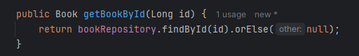

### A publisher alapján kereső metódus

A következő metódus a könyv objektum publisher adattagja alapján ad vissza egy listát, az összes Book objektummal, amelynek a kiadója a megadott kiadó. 

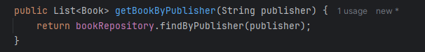

### Az entitást elmentő metódus

A mentést a következő kódsor végzi:

### A felülírást végrehajtó metódus

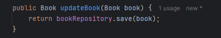

Az utóbbi kettő között a különbség majd a Controller osztályban végrehajtott requestek között lesz. Az előbbi metódust egy POST kéréshez, az utóbbit egy PUT kéréshez használjuk fel.

### A törlést végrehajtó metódus

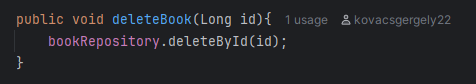

## A vezérlő létrehozása

A controller package-ben létrehozzuk az adott entitáshoz tartozó vezérlő osztályt, amit ellátunk a @RestController annotációval.
Ez biztosít számunkra egy REST API vezérlőt, a megfelelő működéséhez ellátjuk a @RequestMapping annotációval is, amely a végpont url-jét adja meg.
Majd létrehozunk egy Service objektumot, amelyet ellátunk @Autowired annotációval, hogy a Spring IoC kezelje azt helyettünk.

### Az összes entitás visszaadását végrehajtó GET metódus

A kérésre történő válaszadás a @GetMapping annotáció segítségével történik. Létrehozunk egy entitás objektumokat tartalmazó listával dolgozó metódust, amely visszaadja az összes adatbázisban megtallálható entitást.

### Az Id alapján kereső GET metódus

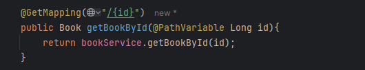

### A publisher alapján keresó GET metódus

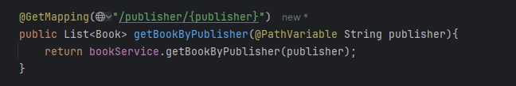

A kettő utóbbinál a @PathVariable annotáció segítségével az elérési utat adjuk meg.

### A POST kérést végrehajtó metódus

A @PostMapping annotáció segítségével jelölhetjük azt a metódust, amellyel POST kérést szeretnénk végrehajtani. A metódus a következő:

### A PUT kérést végrehajtó metódus

A @PutMapping annotáció segítségével hajthatunk végre PUT kérést.

### A DELETE kérést végrehajtó metódus

A @DeleteMapping annotáció segítségével hajthatunk végre törlési kérést.

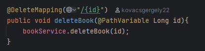

## Adatbázis műveletek

Az adatbázis-táblák létrehozása során különböző annotációkkal elnevezhetjük az adatbázis-táblák összetevőit. A @Table(name = "orders") segítségével nevezhetjük el a táblát a @Column segítségével pedig a táblát alkotó oszlopok neveit adhatjuk meg (ezek egyébként az objektum adattagjai).

Az Order objektum esetében kapcsoltam össze táblákat, mivel a rendelés során hivatkozunk User és Book osztályokra is.

Az adatbázis táblák kapcsolása történhet a @OneToOne a @OneToMany és a @ManyToOne annotációk segítségével (ez az objektumok közötti kapcsolat számosságát adja meg).

Az Order entitás kódja:

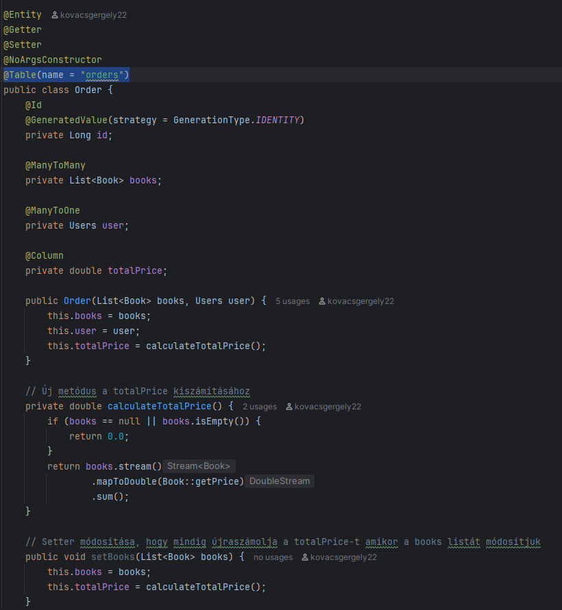

A @ManyToMany annotáció automatikusan létrehoz egy kapcsolótáblát (ORDERS-BOOKS):

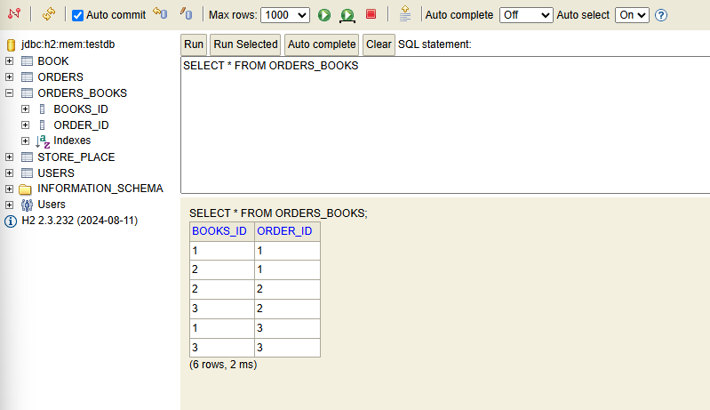

## A projekt futtatása

Ahhoz, hogy a kód lefusson, hogy további konfigurálástól megkíméljük magunkat, szükséges ellátni a @SpringBootApplication annotációval:

Ha a Spring Initalizr segítségével (vagy az IntelliJ Idea Ultimate verziójával) ez automatikusan generálható.

## Ellenőrzés Postman segítségével

### GET kérés végrehajtása

### GET kérés Id alapján

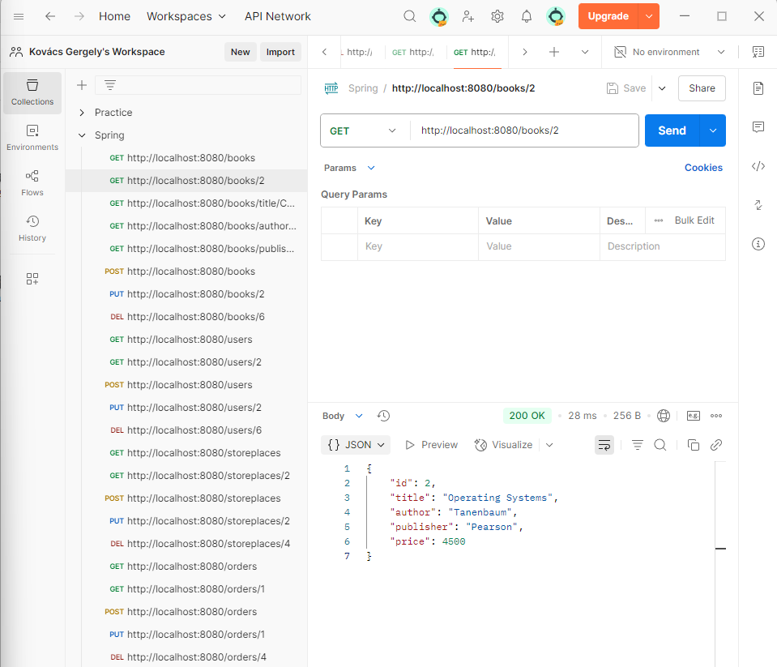

### GET kérés author alapján, listában

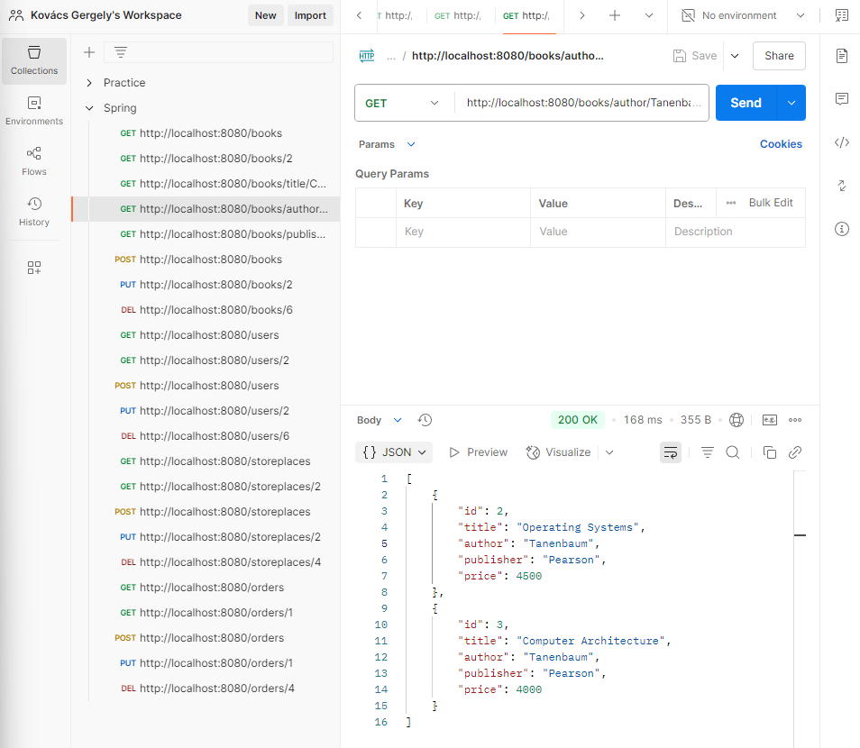

### POST request végrehajtása

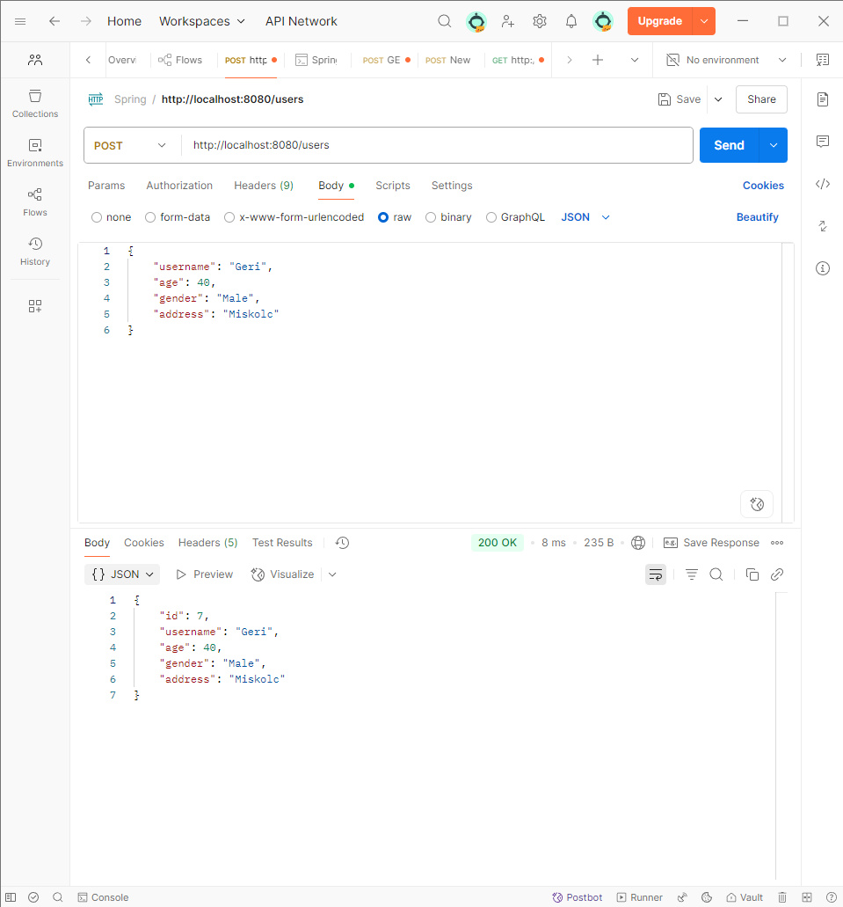

### PUT request

A korábbi GET request segítségével kért 2-es Id számú objektum módosítása:

Módosítás után az újabb GET request eredménye:

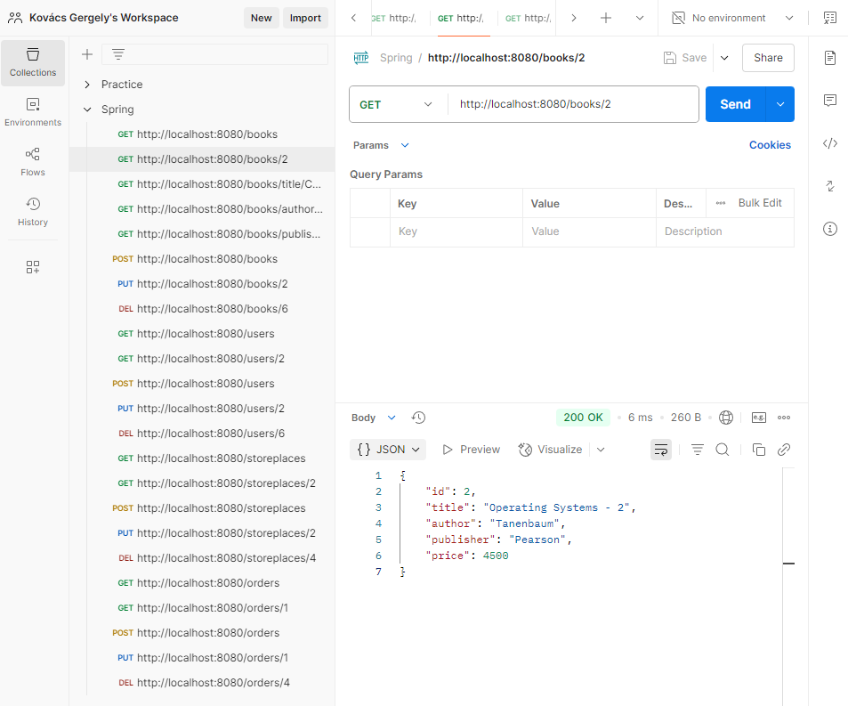

A cím módosult "Operating Systems"-ről "Operating Systems - 2"-re.

### DELETE request

A korábban hozzáadott, 6-os Id-vel ellátott objektum törlése:

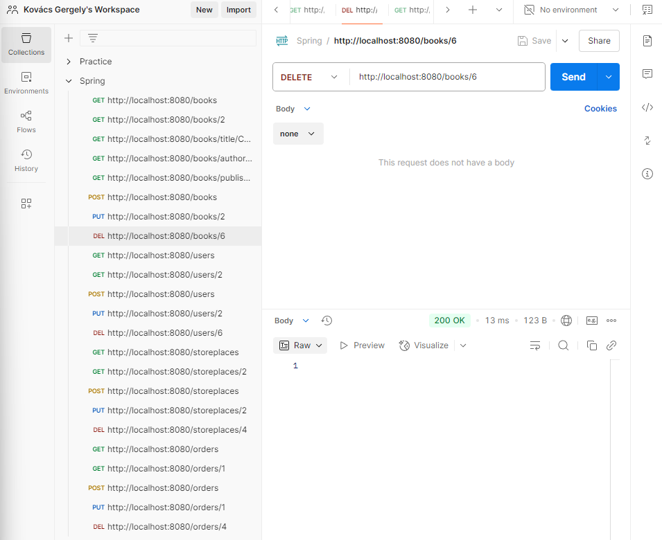

A képen látható 200 OK válasz mutatja, hogy a törlés sikeresen végre lett hajtva.

## H2 Console

Az adatbázis eléréséhez használható a H2 console, amit korábban engedélyeztünk. Elérhető a következő linken:
(http://localhost:8080/h2-console). Az eredmény a book és a users létrehozása után:

A többi entitás és az azokat kezelő osztályok és metódusok létrehozása az előzőek alapján történik.

## Felhasznált segédanyag:

- [60 Days of Java : The Complete Java Masterclass - Udemy](https://www.udemy.com/course/javamasterclass/)
- [baeldung.com a H2 adatbázishoz](https://www.baeldung.com/spring-boot-h2-database)
- [h2database.com](https://www.h2database.com/html/features.html#feature_list)
- [Spring Boot 3, Spring 6 & Hibernate for Beginners - Udemy](https://www.udemy.com/course/spring-hibernate-tutorial/)
- IntelliJ Idea AI chat (ahol használtam benne hagytam az AI magyarázó megjegyzéseit)
